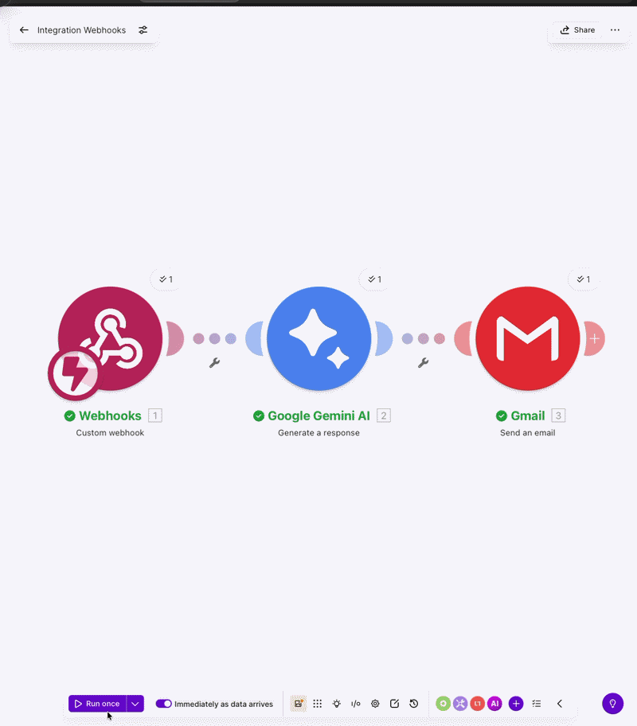

# 🤖 Lead Follow-up Automation

An AI-powered workflow that sends personalized follow-up emails to leads within 60 seconds of form submission — automatically, with zero manual effort.

Built for Egyptian businesses that lose leads due to slow response times.

---

## The Problem

78% of leads go with the first business that responds. Most businesses take hours or days to follow up manually. This automation closes that gap completely.

---

## Demo



*Lead submits form → personalized AI email arrives in under 60 seconds*

---

## How It Works

| Step | Module | Action |
|---|---|---|
| 1 | Google Form | Lead submits their info |
| 2 | Apps Script | Sends JSON to webhook |
| 3 | Make Webhook | Receives data instantly |
| 4 | Gemini AI | Writes personalized email |
| 5 | Gmail | Sends it in under 60 sec |

---

## Features

- **Instant response** — email sent within 60 seconds of form submission
- **AI-personalized** — Gemini reads the lead's business type and main challenge, writes a unique email every time
- **Zero manual effort** — runs 24/7 automatically
- **Free to run** — Make.com free tier + Gemini free tier
- **Bilingual ready** — Arabic + English support possible

---

## Tech Stack

| Technology | Purpose |
|---|---|
| Google Forms | Lead capture |
| Google Apps Script | Form-to-webhook bridge |
| Make.com | Workflow automation |
| Google Gemini AI (2.5 Flash) | Personalized email generation |
| Gmail API | Email delivery |

---

## Setup

**1. Create the Google Form**

Fields: Full Name, Email, Business Type, Main Challenge

**2. Connect to Google Sheets + Apps Script**

```javascript
function onFormSubmit(e) {
  var data = {
    name: e.values[1],
    email: e.values[2],
    business_type: e.values[3],
    main_challenge: e.values[4]
  };
  UrlFetchApp.fetch("YOUR_MAKE_WEBHOOK_URL", {
    method: "post",
    contentType: "application/json",
    payload: JSON.stringify(data)
  });
}
```

**3. Build Make.com workflow**

Webhook → Google Gemini AI → Gmail Send

**4. Activate scenario**

Toggle "Immediately as data arrives" to ON

---

## Performance

- Response time: under 60 seconds
- Personalization: unique email per lead
- Cost: $0 (free tier)
- Uptime: 24/7 automatic

---

## Pricing for Clients

| Package | Price |
|---|---|
| Setup (one-time) | $200 – $500 |
| Monthly maintenance | $50 – $100 |

---

## Use Cases

- Restaurants following up with new customers
- Real estate agents contacting interested buyers
- Clinics responding to patient inquiries
- Service businesses auto-responding to quote requests

---

## Author

**Patrick Amin** — AI Automation Developer
Cairo, Egypt
patrick.ebeid@gmail.com
[GitHub](https://github.com/patrickamin)

---

*Specialized in Arabic + English AI automation for Egyptian businesses.*
